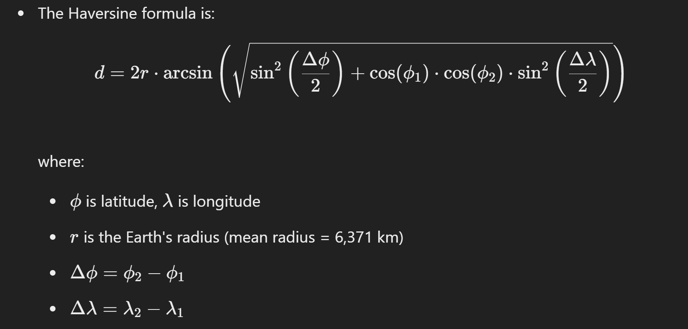

# Python Tuples Assignment

## Questions

### Easy Questions

1. **City Coordinates**
   - You are building a geographic information system (GIS) and need to store coordinates (latitude and longitude) for cities. Create a tuple named `city_coords` for a city named `"New York"` with coordinates `(40.7128, -74.0060)`.
   - Print the coordinates of `"New York"` from the tuple.

2. **Movie Database**
   - You are building a movie database and need to store details of movies. Create a tuple named `movie1` containing the details for a movie: `"Inception"`, `2010`, `8.8`.
   - Print the release year of the movie from the tuple.

3. **Weather Data**
   - You are collecting weather data for a city. Each record includes a date, temperature, and precipitation. Create a list of tuples named `weather_data` where each tuple contains weather details for different days: `("2024-06-20", 25.3, 0.0)`, `("2024-06-21", 26.7, 0.2)`, `("2024-06-22", 24.8, 0.0)`.
   - Print the weather details for `2024-06-21`.

### Medium Questions


4. **Finding Closest City**
   - Given a list of cities with their coordinates, `cities = [("New York", (40.7128, -74.0060)), ("Los Angeles", (34.0522, -118.2437)), ("Chicago", (41.8781, -87.6298))]`, and a target city with its coordinates, `target_city = ("San Francisco", (37.7749, -122.4194))`, determine and print the name of the city from the list that is closest to the target city using the Euclidean distance formula.


### Advanced Questions

5. **Sensor Data with Aggregation**
   - You are collecting data from sensors. Each reading includes a timestamp, location, and value. Create a list of tuples named `sensor_readings` containing multiple sensor readings: 
     ```python
     sensor_readings = [
         ("2024-06-25 14:00:00", (40.7128, -74.0060), 23.5),
         ("2024-06-25 15:00:00", (40.7128, -74.0060), 24.1),
         ("2024-06-25 16:00:00", (40.7128, -74.0060), 22.8),
         ("2024-06-25 14:00:00", (34.0522, -118.2437), 26.5),
         ("2024-06-25 15:00:00", (34.0522, -118.2437), 27.3),
         ("2024-06-25 16:00:00", (34.0522, -118.2437), 25.6),
         ("2024-06-25 14:00:00", (41.8781, -87.6298), 21.5),
         ("2024-06-25 15:00:00", (41.8781, -87.6298), 22.1),
         ("2024-06-25 16:00:00", (41.8781, -87.6298), 20.8)
     ]
     ```
   - Calculate the average sensor reading value for each unique location.
   - Print the average value for each location in the format: `(latitude, longitude): average_value`.

6. **Distance Calculation**
   - Given two tuples representing coordinates of two cities, `city1 = (40.7128, -74.0060)` and `city2 = (34.0522, -118.2437)`, calculate the approximate distance between the two cities using the Haversine formula.
   

   7. **Optimizing Delivery Routes**
   - You are optimizing delivery routes for a logistics company. Given a list of delivery stops with their coordinates, `stops = [("Stop1", (40.7128, -74.0060)), ("Stop2", (34.0522, -118.2437)), ("Stop3", (41.8781, -87.6298))]`, and the starting point `(37.7749, -122.4194)`, determine the order of stops that minimizes the total travel distance using the Euclidean distance formula. Print the optimal order of stops.

---
&copy; Pranav Mehendale, Yashashri Computers, Kothrud, Pune 2024. All rights reserved. This material is for non-commercial use only.

---